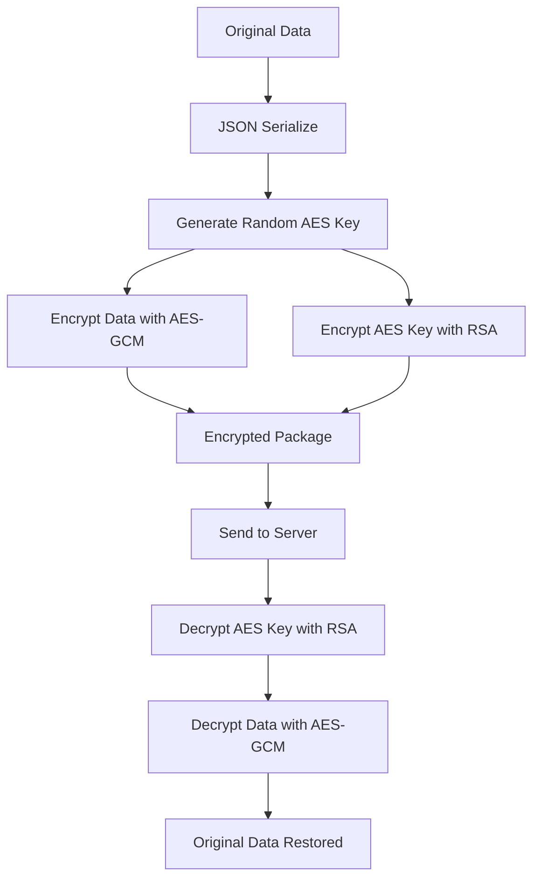

# Core Functionality Documentation

## Overview

The **@ics/hybrid-encryption** core module provides cross-platform hybrid
encryption using RSA + AES-GCM. This approach combines the security of
asymmetric encryption (RSA) with the performance of symmetric encryption (AES)
to create a robust, scalable encryption solution.

## What is Hybrid Encryption?

Hybrid encryption solves the key limitations of using RSA or AES alone:

- **RSA alone**: Secure but slow for large data and has size limits (~245 bytes
  for 2048-bit keys)
- **AES alone**: Fast but requires securely sharing the symmetric key
- **Hybrid approach**: Use RSA to encrypt a randomly generated AES key, then use
  AES to encrypt the actual data

### How It Works



## Key Features

✅ **Cross-Platform**: Works in React, React Native, and Node.js  
✅ **Secure**: RSA-OAEP + AES-256-GCM with authentication  
✅ **Fast**: Optimized with @noble/ciphers (fastest pure JS implementation)  
✅ **Type-Safe**: Full TypeScript support with comprehensive types  
✅ **Flexible**: Configurable key sizes and padding schemes  
✅ **Authenticated**: Built-in tamper detection with GCM auth tags

## Installation

```bash
npm install node-forge @noble/ciphers @types/node-forge
```

## API Reference

### Main Class: `HybridEncryption`

The core class providing all encryption functionality.

#### Static Methods

##### `encrypt(data, publicKeyPem, options?)`

Encrypts data using hybrid RSA + AES approach.

**Parameters:**

- `data: any` - Data to encrypt (will be JSON serialized)
- `publicKeyPem: string` - RSA public key in PEM format
- `options?: EncryptionOptions` - Optional encryption settings

**Returns:** `EncryptedData` - Encrypted data structure

**Example:**

```typescript
const data = { message: 'Secret data', userId: 123 };
const encrypted = HybridEncryption.encrypt(data, publicKey);
```

##### `decrypt<T>(encryptedData, privateKeyPem, options?)`

Decrypts data using hybrid RSA + AES approach.

**Parameters:**

- `encryptedData: EncryptedData` - Encrypted data structure
- `privateKeyPem: string` - RSA private key in PEM format
- `options?: EncryptionOptions` - Optional decryption settings

**Returns:** `T` - Original decrypted data (typed)

**Example:**

```typescript
const decrypted = HybridEncryption.decrypt<MyDataType>(encrypted, privateKey);
```

##### `generateRSAKeyPair(keySize?)`

Generates a new RSA key pair.

**Parameters:**

- `keySize?: number` - RSA key size in bits (default: 2048, minimum: 2048)

**Returns:** `RSAKeyPair` - Generated key pair with metadata

**Example:**

```typescript
const keyPair = HybridEncryption.generateRSAKeyPair(2048);
console.log(keyPair.publicKey); // PEM format
console.log(keyPair.privateKey); // PEM format
```

##### `validateKeyPair(keyPair)`

Tests if a key pair works correctly by performing encryption/decryption round
trip.

**Parameters:**

- `keyPair: RSAKeyPair` - Key pair to validate

**Returns:** `boolean` - True if key pair is valid

**Example:**

```typescript
const isValid = HybridEncryption.validateKeyPair(keyPair);
if (!isValid) {
  throw new Error('Invalid key pair!');
}
```

##### `isKeyPairExpired(keyPair)`

Checks if a key pair has expired based on its expiry date.

**Parameters:**

- `keyPair: RSAKeyPair` - Key pair to check

**Returns:** `boolean` - True if expired

**Example:**

```typescript
if (HybridEncryption.isKeyPairExpired(keyPair)) {
  console.log('Key pair needs rotation!');
}
```

### Convenience Functions

For easier imports and usage, the core module also exports convenience
functions:

```typescript
import { encrypt, decrypt, generateRSAKeyPair, validateKeyPair } from './core';

// Identical to class methods but shorter syntax
const encrypted = encrypt(data, publicKey);
const decrypted = decrypt(encrypted, privateKey);
const keyPair = generateRSAKeyPair();
const isValid = validateKeyPair(keyPair);
```

## Type Definitions

### `RSAKeyPair`

```typescript
interface RSAKeyPair {
  publicKey: string; // PEM format
  privateKey: string; // PEM format
  version?: number; // Key version for rotation
  createdAt?: Date; // Generation timestamp
  expiresAt?: Date; // Expiry timestamp
}
```

### `EncryptedData`

```typescript
interface EncryptedData {
  encryptedContent: string; // Base64 encoded AES-GCM encrypted data
  encryptedAESKey: string; // Base64 encoded RSA encrypted AES key
  iv: string; // Base64 encoded initialization vector
  authTag: string; // Base64 encoded GCM authentication tag
  version: string; // Library version for compatibility
}
```

### `EncryptionOptions`

```typescript
interface EncryptionOptions {
  keySize?: 128 | 192 | 256; // AES key size in bits (default: 256)
  rsaPadding?: 'OAEP' | 'PKCS1'; // RSA padding scheme (default: 'OAEP')
}
```

## Usage Examples

### Basic Usage

```typescript
import { HybridEncryption } from './core/encryption';

// 1. Generate key pair
const keyPair = HybridEncryption.generateRSAKeyPair(2048);

// 2. Encrypt data
const secretData = {
  creditCard: '1234-5678-9012-3456',
  userId: 12345,
  permissions: ['read', 'write'],
};

const encrypted = HybridEncryption.encrypt(secretData, keyPair.publicKey);

// 3. Send encrypted data (safe to transmit)
console.log('Encrypted package:', encrypted);

// 4. Decrypt data
const decrypted = HybridEncryption.decrypt(encrypted, keyPair.privateKey);
console.log('Decrypted data:', decrypted);
```

### With Custom Options

```typescript
// Use AES-128 with PKCS1 padding
const options = {
  keySize: 128 as const,
  rsaPadding: 'PKCS1' as const,
};

const encrypted = HybridEncryption.encrypt(data, publicKey, options);
const decrypted = HybridEncryption.decrypt(encrypted, privateKey, options);
```

### Error Handling

```typescript
try {
  const encrypted = HybridEncryption.encrypt(data, publicKey);
  const decrypted = HybridEncryption.decrypt(encrypted, privateKey);
} catch (error) {
  if (error.message.includes('Encryption failed')) {
    console.error('Failed to encrypt data:', error);
  } else if (error.message.includes('Decryption failed')) {
    console.error('Failed to decrypt data:', error);
  }
}
```

### Large Data Handling

```typescript
// The library efficiently handles large objects
const largeData = {
  users: Array.from({ length: 10000 }, (_, i) => ({
    id: i,
    name: `User ${i}`,
    email: `user${i}@example.com`,
    metadata: { created: new Date(), active: true },
  })),
};

const encrypted = HybridEncryption.encrypt(largeData, publicKey);
const decrypted = HybridEncryption.decrypt(encrypted, privateKey);
```

### Key Validation and Rotation

```typescript
// Check if keys are still valid
const keyPair = generateRSAKeyPair();

if (!HybridEncryption.validateKeyPair(keyPair)) {
  throw new Error('Generated invalid key pair!');
}

if (HybridEncryption.isKeyPairExpired(keyPair)) {
  console.log('Generating new keys...');
  const newKeyPair = HybridEncryption.generateRSAKeyPair();
}
```

## Security Considerations

### Cryptographic Strength

- **RSA**: Minimum 2048-bit keys (library enforces this)
- **AES**: 256-bit keys by default (128/192 also supported)
- **Padding**: RSA-OAEP by default (more secure than PKCS1)
- **Authentication**: AES-GCM provides built-in authentication

### Best Practices

1. **Key Management**: Rotate keys regularly (monthly recommended)
2. **Key Storage**: Never store private keys in client-side code
3. **Transport**: Always use HTTPS when transmitting encrypted data
4. **Validation**: Always validate key pairs after generation
5. **Error Handling**: Don't expose cryptographic errors to end users

### What's Protected

✅ **Data Confidentiality**: Only holder of private key can decrypt  
✅ **Data Integrity**: GCM auth tag detects any tampering  
✅ **Replay Protection**: Random IV prevents identical ciphertexts  
✅ **Key Security**: AES keys are randomly generated per encryption

### What's NOT Protected

❌ **Traffic Analysis**: Encrypted data size reveals original size  
❌ **Timing Attacks**: Implementation may leak timing information  
❌ **Side Channels**: No protection against power/electromagnetic analysis  
❌ **Forward Secrecy**: Compromised private key affects all past data

## Performance Characteristics

### Benchmarks (Typical)

- **Key Generation**: ~150ms for 2048-bit RSA
- **Encryption**: ~2ms for 1KB data
- **Decryption**: ~5ms for 1KB data
- **Memory**: Low memory usage, no significant leaks

### Optimization Tips

1. **Cache Keys**: Generate keys once, reuse multiple times
2. **Batch Operations**: Process multiple encryptions together
3. **Choose Key Size**: Use 2048-bit for balance of security/performance
4. **Monitor Performance**: Use built-in test function for benchmarks

```typescript
// Built-in performance test
import { runCoreEncryptionTest } from './core/encryption';
const results = runCoreEncryptionTest();
console.log(`Performance: ${results.performanceMs}ms for 100 cycles`);
```

## Platform Compatibility

### Supported Environments

✅ **Node.js**: 16.0.0+  
✅ **React**: Modern browsers with crypto.getRandomValues  
✅ **React Native**: With crypto polyfill if needed  
✅ **Electron**: Full support  
✅ **Browser**: Modern browsers (ES2020+)

### Platform-Specific Notes

**React Native**: May need crypto polyfill:

```bash
npm install react-native-get-random-values
```

**Browser**: Uses Web Crypto API for random number generation

**Node.js**: Uses built-in crypto module or falls back to forge

## Error Reference

### Common Errors

| Error Message                             | Cause                               | Solution           |
| ----------------------------------------- | ----------------------------------- | ------------------ |
| `RSA key size must be at least 2048 bits` | Key too small                       | Use 2048+ bit keys |
| `Encryption failed`                       | Invalid public key                  | Check key format   |
| `Decryption failed`                       | Wrong private key or corrupted data | Verify key pair    |
| `Unsupported version`                     | Version mismatch                    | Update library     |

### Debugging Tips

1. **Test Key Pairs**: Use `validateKeyPair()` to verify keys work
2. **Check Formats**: Ensure keys are in PEM format
3. **Verify Data**: Ensure `EncryptedData` structure is complete
4. **Run Tests**: Use built-in test function to verify setup

## Next Steps

The core functionality provides the foundation for:

1. **Client Package**: Simple encryption functions for frontend
2. **Server Package**: Express middleware and route handlers
3. **Key Management**: Automated rotation and caching
4. **Storage**: File system and memory key storage
5. **Monitoring**: Logging and performance tracking

For complete usage examples, see the `/examples` directory in the project
structure.
